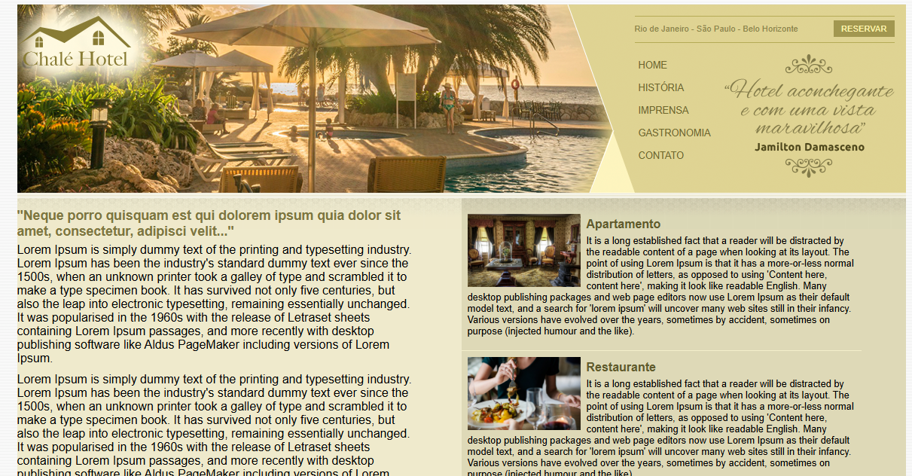

# Chal--Hotel
Projeto Academico

# 🏨 Chalé Hotel — Projeto de Site Completo

Este é um projeto de site institucional desenvolvido para treinar **HTML5**, **CSS3**, estruturação de layout, posicionamento, menus, colunas e uso de imagens no design de páginas web.

O objetivo do projeto é reproduzir o layout de um **site de hotel**, com áreas bem definidas como:
- Cabeçalho com logo
- Menu de navegação
- Área principal de conteúdo
- Barra lateral com benefícios
- Rodapé estilizado

link : https://didantas2.github.io/Chal--Hotel/


---

## 🎯 Objetivos do projeto

- Praticar **estruturação de páginas completas**
- Exercitar **CSS avançado**, como:
  - posicionamento absoluto e relativo  
  - uso de floats  
  - background com imagens  
  - menus horizontais  
  - colunas lado a lado  
- Organizar o layout em blocos sem uso de frameworks
- Simular um site real de hotelaria

---

## 🖼️ Screenshot do projeto

```markdown

